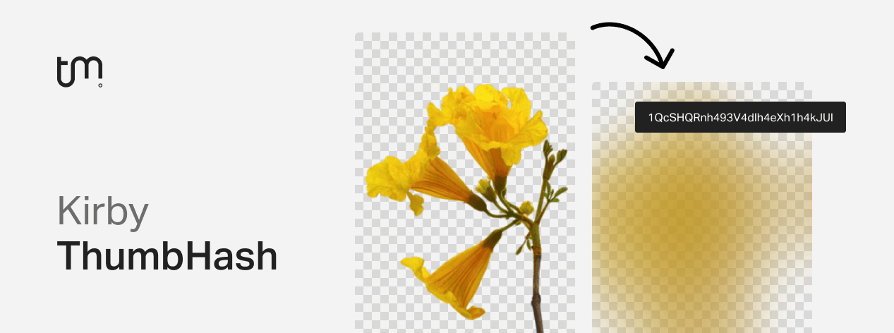

# Kirby ThumbHash

[ThumbHash](https://evanw.github.io/thumbhash/) is an alternative image placeholder algorithm.
Placeholders are represented by small ∼28 bytes hashes. It's similar to [BlurHash](https://blurha.sh/) but with the following advantages:

- Encodes more detail in the same space
- Also encodes the aspect ratio
- Gives more accurate colors
- Supports images with alpha

This plugin adds ThumbHash support to Kirby, allowing you to implement UX improvements such as progressive image loading or content-aware spoiler images [like Mastodon](https://blog.joinmastodon.org/2019/05/improving-support-for-adult-content-on-mastodon/).

If you rather want to use BlurHash in your application, feel free to use my [kirby-blurhash](https://github.com/tobimori/kirby-blurhash) plugin.

Under the hood, the heavy work gets done by a PHP implementation of ThumbHash by [SRWieZ](https://github.com/SRWieZ): [SRWieZ/thumbhash](https://github.com/SRWieZ/thumbhash)

## Requirements

- Kirby 3.9.2+ for asset methods
- PHP 8.0+
- `gd` extension

## Installation

### Download

Download and copy this repository to `/site/plugins/kirby-thumbhash`.

### Composer

```
composer require tobimori/kirby-thumbhash
```

## Usage

### Client-side decoding

#### **`$file->thumbhash()`**

> Encodes the image with ThumbHash and returns ThumbHash as a string

The default implementation of ThumbHash expects the string to be decoded on the client-side.

This provides the most benefits, most notably including better color representation and smaller payload size, but requires the initial execution of such a library on the client-side, and thus is better used with a headless site or heavily makes use of client-side infinite scrolling/loading.

With an lazy-loading library like [unlazy](https://unlazy.byjohann.dev/) you can implement lazy-loading with client-side decoding easily by providing the thumbhash as attribute.

```php
thumbhash() ?>"
  data-src="<?= $image->url() ?>" // Original src attribute will be placed by unlazy
  loading="lazy"
  alt="<?= $image->alt() ?>"
/>
```

### Server-side decoding

#### **`$file->thumbhashUri()`**

> Encodes the image with ThumbHash, then decodes & rasterizes it. Finally returns it as a data URI which can be used without any client-side library.

In addition to simply outputting the ThumbHash string for usage on the client-side, this plugin also provides a server-side decoding option that allows you to output a base64-encoded image string, which can be used as a placeholder image without any client-side libraries, similar to [Kirby Blurry Placeholder](https://github.com/johannschopplich/kirby-blurry-placeholder).

This is especially useful when you only have a few images on your site or don't want to go through the hassle of using a client-side library for outputting placeholders. Using this approach, you'll still get better color representation of the ThumbHash algorithm than with regularly downsizing an image, but image previews will still be about ~1kB large.

```php
thumbhashUri() ?>" />
```

### Cropped images

Kirby doesn't support file methods on cropped images, so you'll have to use the original image, and pass the ratio as attribute to the element to get the correct ThumbHash.

```php
<?php $cropped = $original->crop(500, 400) ?>
thumbhashUri(5/4) ?>"
  data-src="<?= $cropped->url() ?>"
  data-lazyload
  alt="<?= $original->alt() ?>"
/>
```

This is also supported by `$file->thumbhash($ratio)`.

### Working with static assets (using `asset()` helper)

All methods are available as asset methods since Kirby 3.9.2.

```php
asset('assets/image.jpg')->thumbhash();
asset('assets/image.jpg')->thumbhashUri();
```

[Read more about the `asset()` helper here](https://getkirby.com/docs/reference/objects/filesystem/asset).

### Aliases

```php
$file->th(); // thumbhash()
$file->thUri(); // thumbhashUri()
```

### Clear cache

The encoding cache is automatically cleared when an image gets replaced or updated, however you can also clear the cache manually with the `clearCache` static method:

```php
<?php

use tobimori\ThumbHash;

ThumbHash::clearCache($file);
```

This might be helpful when you use third party plugins to edit your images, and they do not trigger Kirby's internal file update hooks but instead have their own.

## Options

| Option          | Default | Description                                                                    |
| --------------- | ------- | ------------------------------------------------------------------------------ |
| `cache.decode`  | `true`  | Enable decoding cache                                                          |
| `cache.encode`  | `true`  | Enable encoding cache                                                          |
| `sampleMaxSize` | `100`   | Max width or height for smaller image that gets encoded (watch out for memory) |

Options allow you to fine tune the behaviour of the plugin. You can set them in your `config.php` file:

```php
return [
    'tobimori.thumbhash' => [
        'sampleMaxSize' => 100,
    ],
];
```

## Comparison

// TODO

## Credits

- Johann Schopplich's [Kirby Blurry Placeholder](https://github.com/johannschopplich/kirby-blurry-placeholder) plugin that set the baseline for this plugin (Licensed under [MIT License](https://github.com/johannschopplich/kirby-blurry-placeholder/blob/main/LICENSE) - Copyright © 2020-2022 Johann Schopplich)

## License

[MIT License](./LICENSE)
Copyright © 2023 Tobias Möritz
